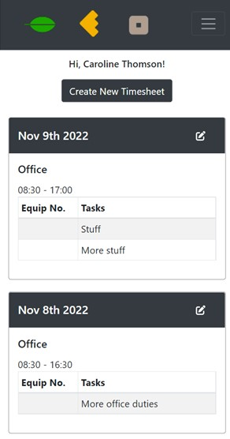
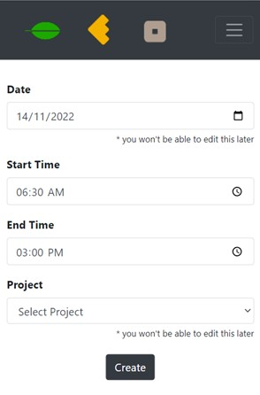
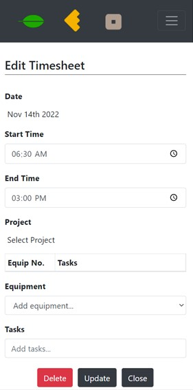
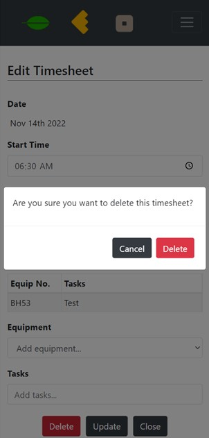
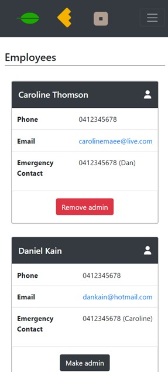
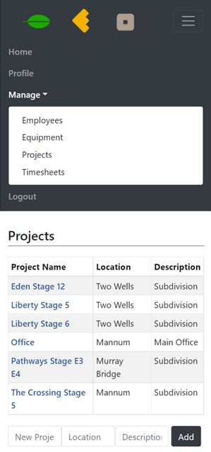
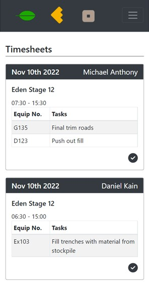
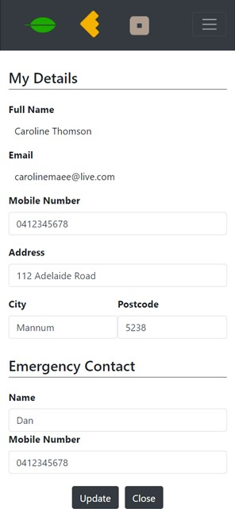

# Job Tracker

## Description
A web based application that gives employers the ability to track employee tasks on projects, review project progression, and machine/equipment activity.

---
## Contents
1. [Usage](#usage)
1. [Screenshots](#screenshots)
1. [Links](#links)
---
## Usage
### Login
Employees that have already created a login for the application can login by simply entering their email address and password that they registered when signing up. If not signed up yet, view instructions to signup.

### Signup
A new employee can signup by using the link supplied, navigating to the /signup page and creating a login by entering their details and a password to access the site later.

### Profile
Once the employee has created a login by signing up, they will immediately be redirected to the Profile page. Here they can add additional details, such as phone number, address, and emergency contact details.

### Homepage
The homepage will automatically display all the logged in users timesheets that they have created. They will also be able to create a new timesheet or edit an existing timesheet from here.

### Projects
Projects can be created by a user with administrative rights. This enables employees to select the project when creating a timesheet, which will log any activity to that project. Each timesheet will have a project.

### Equipment
Equipment can also be added to the database by a user with administrative rights. This enables employees to log completed tasks on a machine, on their timesheets. Timesheets can have many equipment and tasks logged.

### Timesheets
Timesheets can be created from the homepage, and if the user has administrative rights, they will also be able to view all employee timesheets by using the navigation bar to navigate to. If the user has admin rights, they will also be able to view and approve all timesheets for further processing, such as payroll processing. Admins can also click on a project name from the Projects page to navigate to all timesheets that are relevant to that project.

### Employees
All employee details can be viewed if the user has administrative rights. An admin can also give other employees administrative rights in order to have access to the additional features.

---
## Screenshots

^ Homepage view

^ Creating a Timesheet

^ Editing a Timesheet

^ Timesheets can be deleted from the edit page

^ Employees with administrative rights can view other employee details and give them admin rights

^ Projects list with links to view timesheets specific to selected project

^ Timesheets list where timesheets can be approved

^ Profile that shows logged in employees details and can edit

---

## Links
Deployed Link: [https://vast-woodland-80895.herokuapp.com](https://vast-woodland-80895.herokuapp.com)

GitHub Repo: [https://github.com/carolinemae/Job-Tracker.git](https://github.com/carolinemae/Job-Tracker.git)

Email: [carolinemaee@live.com](mailto:carolinemaee@live.com)

[Click to scroll up](#job-tracker)